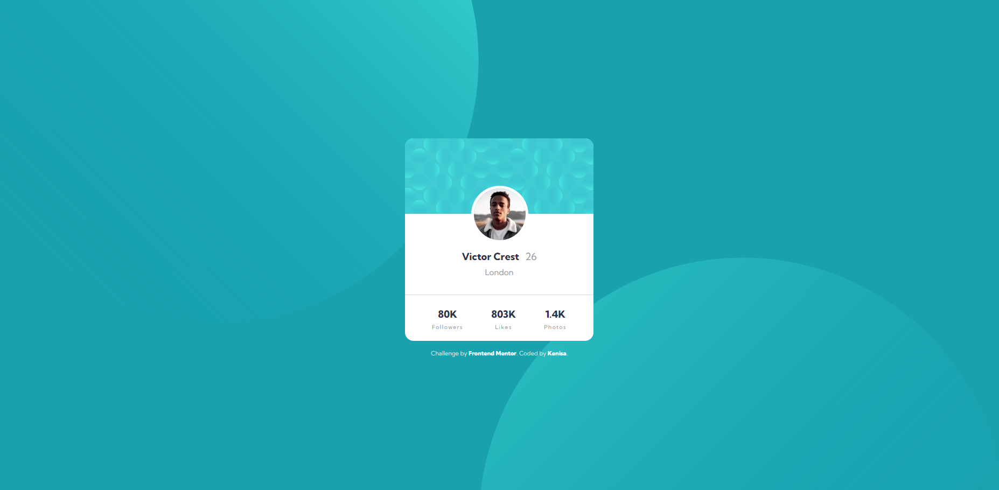

# Frontend Mentor - Profile card component solution

This is a solution to the [Profile card component challenge on Frontend Mentor](https://www.frontendmentor.io/challenges/profile-card-component-cfArpWshJ). Frontend Mentor challenges help you improve your coding skills by building realistic projects. 

## Table of contents

- [Overview](#overview)
  - [The challenge](#the-challenge)
  - [Screenshot](#screenshot)
  - [Links](#links)
- [My process](#my-process)
  - [Built with](#built-with)
  - [What I learned](#what-i-learned)
  - [Useful resources](#useful-resources)
- [Author](#author)

## Overview

### The challenge

- Build out the project to the designs provided

### Screenshot

### Links

- Solution URL: [Link to Solution](https://github.com/KenisaRenee/Profile-Card-Component)
- Live Site URL: [Link to Live Site](https://profile-card-component-omega-orcin.vercel.app/)

## My process

### Built with

- Semantic HTML5 markup
- CSS custom properties
- Flexbox
- Mobile-first workflow

### What I learned

This challenge gave me a chance to learn more about measurements - specifically vw and vh. I also gained a better understanding of the background element in CSS thanks to CSStricks.

### Useful resources

- [CSSTricks](https://css-tricks.com/) - As mentioned above, this helped me understand the background property more by utilizing background-image, background-repeat, background-position, and background-position-x and -y.

## Author

- Frontend Mentor - [@KenisaRenee](https://www.frontendmentor.io/profile/kenisarenee)

